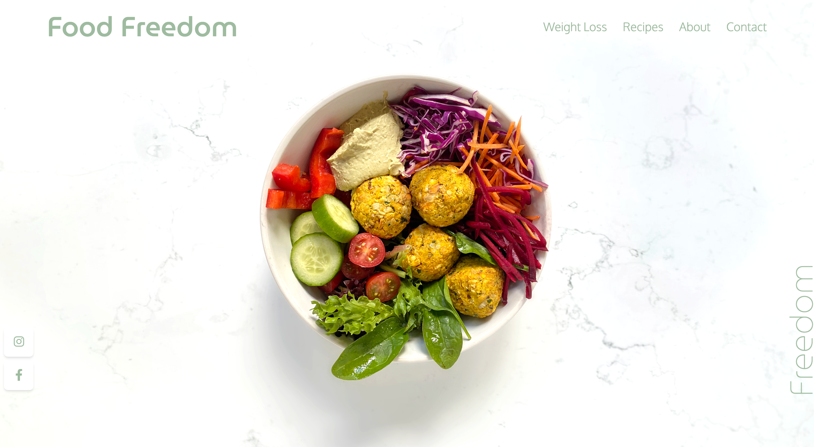
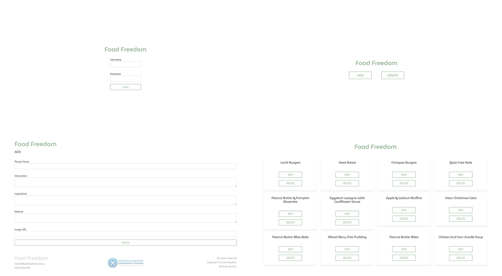

# Food Freedom

Food Freedomn is a Full stacked Web Application built with Python and the Flask framework.
This Application is for a Nutrition Consultant start up business, display their services and showcasing recipes. It has been designed to provide the owner to add, update and delete recipes from the website with a simple and easy to use interface. All secured with admin only login privileges.
The Application is also fully responsive to allow for viewing on any device.

Visit the website [here!](http://foodfreedom.net.au)

## Build Tools

## Database 
The database was built using SQLAlchemy creating a SQLite database for local development. Although when deploying to Heroku the database was converted into a Postgres Database to help persist data. The database can be managed by the admin with friendly UI, following the CRUD operations.

## Contributing 
Got any ideas to help improve the website send me a message or make a pull request.

## Author
🧑🏼‍💻 **Damien England**

Website: https://damienengland.com.au
Linkedin: [Damien England](https://www.linkedin.com/in/damien-england-b67a3a141/)
Email: damien.england@icloud.com

